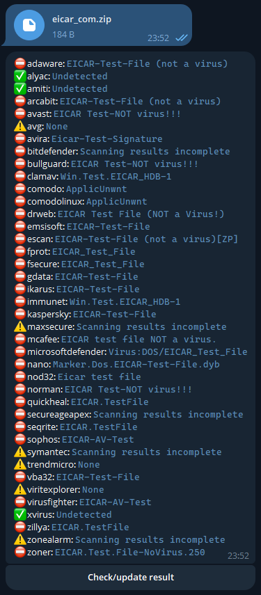

# Гайд по установці бота на хост для маленьких і тупих

1.  ```shell
    python -m venv venv
    ```

2.  ```shell
    . venv/Scripts/activate
    ```
    або
    ```shell
    . venv/bin/activate
    ```

3. ```shell
    pip install -r requirements.txt
    ```

4. Вставить токени в `.env` файлі
5.  ```shell
    PY main.py
    ```

_За працездатність команд хз, я їх не провіряв. Тому земля тобі стекловата, Максімка._

### Вигляд

